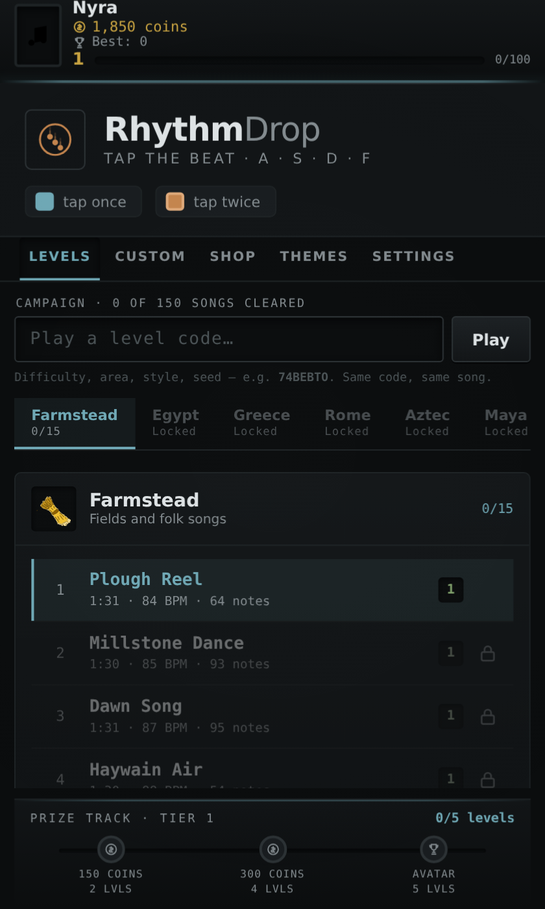
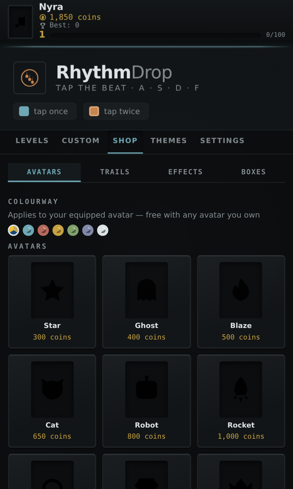
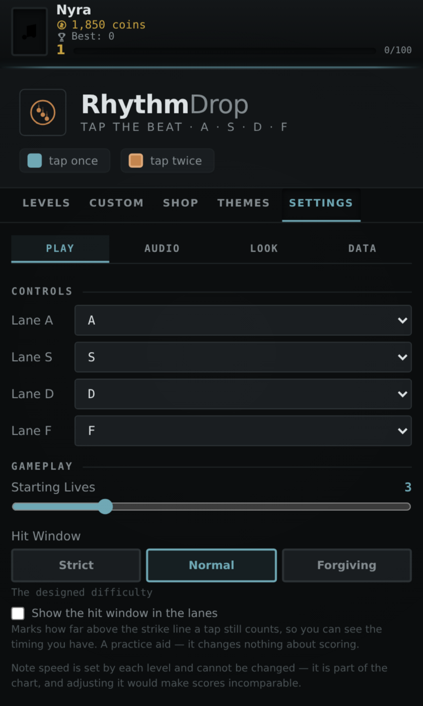

<p align="center">
  
</p>

<h1 align="center">RhythmDrop</h1>
<p align="center"><i>Four lanes. One song at a time.</i></p>

<p align="center">
  A tap-to-the-beat rhythm game, built as a Chrome extension — a 150-song campaign across ten
  historically themed areas, procedurally composed music that's identical on every device,
  a level creator, and a shop economy, all in one popup with no build step and no network calls.
</p>

<p align="center">
  <b>v8.0</b> ·
  <a href="other/HANDOFF-V8.md">Full feature reference</a> ·
  <a href="other/v7/HANDOFF.md">V7, kept alongside</a>
</p>

---

## Screenshots

| | |
|---|---|
|  |  |
| Home — the campaign, ten eras deep | Play — combo lit, a ×2 slab incoming |
|  |  |
| Shop — avatars, trails, effects, mystery boxes | Settings — hit window, key remap, a visible timing band |

<p align="center"><br><sub>The level creator — two-stage note placement, multi-select cut/copy/paste, a live sound preview</sub></p>

## What it is

Hit **A · S · D · F** as slabs cross the strike line. Tap once for a single note, twice for the bordered ×2 slabs. That's the whole input model — everything else is depth: a 150-level campaign, a chord-aware music generator, a chart editor, and a full customization economy sitting on top of it.

- **Campaign** — 10 areas × 15 levels, **shipped as data rather than generated at boot**. The songs were composed once by a deterministic generator and baked into `levels.js`; the generator is kept as a build tool, so the campaign can be regenerated deliberately but never rewrites itself under you. Areas: Farmstead, Egypt, Greece, Rome, Aztec, Maya, Old England, Napoleonic, Modern, Retro-Future — each with its own scale, instrument and rhythmic character, so Egypt's double-harmonic scale sounds nothing like Farmstead's folk pentatonic. Melody moves in phrases with real cadences and chords stack in actual thirds: 8,658 simultaneous chords across the 150 charts and not one minor second.
- **Progression** — songs unlock in order and areas unlock behind them, XP is keyed off note count and tempo, every level keeps its own record, and a seven-day daily lapses if you miss a day.
- **Level creator** — a grid editor with per-lane default pitches, a per-note picker, sustain and a configurable drum/bass backing. Its advanced panel opens **sideways** and widens the window rather than covering the chart you're editing.
- **Economy** — every level pays a flat coin reward, so grinding a long chart isn't better than clearing a short one. Every purchase is two clicks: the first previews (an avatar goes on your profile, an effect plays live on the board, a mystery box shows its real odds), only the second spends.
- **12 instruments**, synthesized from oscillators — no samples, no network — plus avatars, note trails, mystery boxes and 12 themes including frosted glass, warm paper and arctic white.
- **A Material-3-flavoured shell.** Both graphics styles share it: a rounded shape scale, tonal raised surfaces, state-layer hovers, a faint material grain on *every* theme and an expressive display type. It's a refresh over the original look, not a reskin of one theme — the twelve palettes and their identities are untouched.
- **Two graphics styles.** On top of that shell, *Modern* (default) adds real depth — lit tile edges, raised cards and a glowing strike line. *Classic* keeps the flat look, with no dimensional lighting. The whole depth layer is scoped under one class and stays strictly additive, so turning it off genuinely removes it; `v8graphics` proves the two render differently and that each renders deterministically.
- **Settings** for key remapping, starting lives, UI scale, master and music volume, and instrument choice.
- **Width, not height.** Chrome caps an extension popup at 800×600 and clips the rest, which is why vertical resizing never worked. The height is pinned to that ceiling and only the width is adjustable — everything vertical scrolls.

## Run it

Three ways, all from the same source, no build step:

1. **As the extension it's meant to be** — go to `chrome://extensions`, enable Developer Mode, "Load unpacked," and select `other/RhythmDropV8/`.
2. **Unzip and load** — `RhythmDropV8.zip` is the same folder, zipped, for handing to someone else.
3. **Just open it** — `htmls/RhythmDrop.html` is the entire game as one self-contained file. Double-click it, or open it on a phone. No dependencies, nothing to install, nothing to fetch over the network.

`htmls/RhythmDrop.html` is *generated* from `other/RhythmDropV8/` — every script inlined in place. Never edit it directly; edit the source folder and run `bash other/tools/package.sh`.

**V7 is still here.** The previous game lives whole under `other/v7/` — source, Redesign variant, single-file builds, zips and its own handoff — and still passes its own 25 test suites. V8 is built on the earlier v3.0 source with V7's campaign ported onto it, so the two are genuinely different games rather than versions of one.

## Repo layout

```
RhythmDropV8.zip            the game, zipped — hand this to someone

htmls/
  RhythmDrop.html             the whole game as one file — generated

tests/                      28 suites — 3 for V8, 25 for V7

other/
  RhythmDropV8/               the source — load this as an unpacked extension
    popup.html                  markup, styling, the theme system
    game.js                     screens, input, scoring, campaign UI, shop, creator
    campaign.js                 unlocks, XP, coins, records, dailies
    levels.js                   the 150 songs, baked — generated, not hand-edited
    audio.js                    12 synthesized instruments, limiter, backing layer
  v7/                         the previous game, kept whole and still working
  tools/
    bake-levels.js              composes the 150 songs into levels.js
    build-single.js             inlines the modules into one .html
    build-redesign.js           regenerates V7's Redesign variant
    package.sh                  rebuilds every derived artifact
  docs/screenshots/           the images in this README
  HANDOFF-V8.md               full feature inventory and architecture
```

Everything derived is regenerated by one command:

```
bash other/tools/package.sh
```

Never hand-edit anything in `htmls/`, any `.zip`, or `other/RhythmDropV8/levels.js` — they are all outputs. `package.sh` deliberately does *not* re-bake the campaign: that is a 150-song diff and should be meant, so run `node other/tools/bake-levels.js` yourself when you want it.

## Testing

```
cd tests && npm install && node run-all.js
```

Thirty harnesses. Five cover V8 — the baked campaign against the build that plays it, the progression rules, every instrument rendered and measured through an OfflineAudioContext, the graphics layer, and a real-Chromium pass over the layout and one whole run. The other twenty-five are V7's, unchanged, still green against `other/v7/`.

Eight suites drive a real browser rather than jsdom, because jsdom has no layout engine or audio engine and structurally cannot catch a layout or a silence bug — those are the ones that found the strike line sitting 12–19px off the bar it was drawn on, the campaign list collapsing to a 39px viewport, and the master bus peaking a third past full scale on a seven-note chord.

```
npm run test:v8                                # just the V8 suites
APP_DIR=RhythmDropV7-Redesign node run-all.js  # V7's suites against its variant
```

See [`tests/README.md`](tests/README.md) for the per-suite breakdown, and [`HANDOFF-V8.md`](other/HANDOFF-V8.md#7-testing) for how it fits together.

---

<p align="center"><sub>Built with <a href="https://claude.ai/code">Claude Code</a></sub></p>
