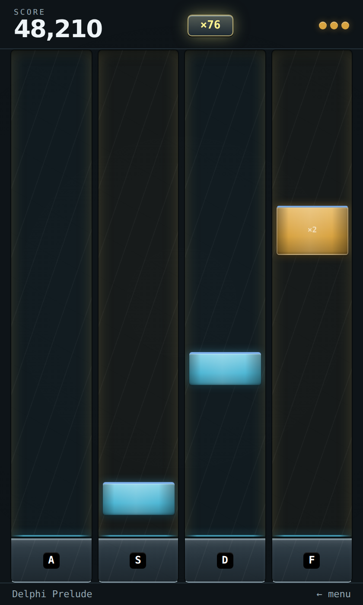
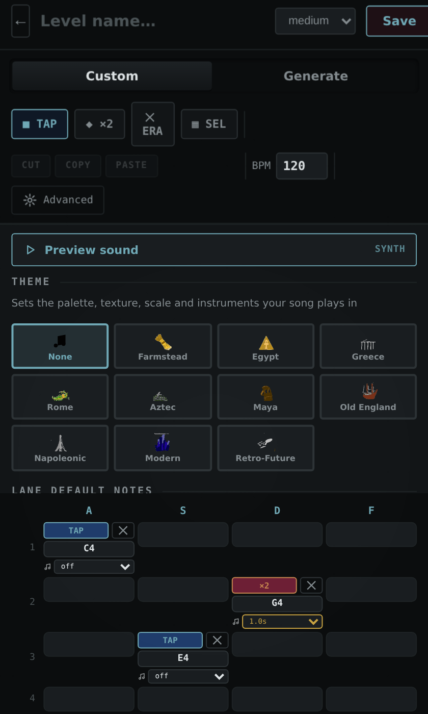

<p align="center">
  
</p>

<h1 align="center">RhythmDrop</h1>
<p align="center"><i>Four lanes. One song at a time.</i></p>

<p align="center">
  A tap-to-the-beat rhythm game, built as a Chrome extension — a 150-song campaign across ten
  historically themed areas, procedurally composed music that's identical on every device,
  a level creator, and a shop economy, all in one popup with no build step and no network calls.
</p>

<p align="center">
  <b>v7.1.4</b> · <code>UPD7 Beta 14</code> ·
  <a href="HANDOFF.md">Full feature reference</a> ·
  <a href="https://claude.ai/code/artifact/c0fa5f5f-4219-465b-a508-3eb080dc500a">Design system</a>
</p>

---

## Screenshots

| | |
|---|---|
|  |  |
| Home — the campaign, ten eras deep | Play — combo lit, a ×2 slab incoming |
|  |  |
| Shop — avatars, trails, effects, mystery boxes | Settings — hit window, key remap, a visible timing band |

<p align="center"><br><sub>The level creator — two-stage note placement, multi-select cut/copy/paste, a live sound preview</sub></p>

## What it is

Hit **A · S · D · F** as slabs cross the strike line. Tap once for a single note, twice for the bordered ×2 slabs. That's the whole input model — everything else is depth: a 150-level campaign, a chord-aware music generator, a chart editor, and a full customization economy sitting on top of it.

- **Campaign** — 10 areas × 15 levels, each chart generated deterministically from its own seed (`mulberry32`, never `Math.random()`), so the same level plays identically on every device, every time. Areas: Farmstead, Egypt, Greece, Rome, Aztec, Maya, Old England, Napoleonic, Modern, Retro-Future — each with its own scale, melodic character, and preferred rhythm patterns, so Egypt's double-harmonic scale sounds nothing like Farmstead's folk pentatonic. Melody moves in phrases with real cadences, chords stack in actual thirds instead of random intervals, and a density penalty means a wall of notes never out-earns a musical chart.
- **The Double** — replay any cleared level at **2× speed**. Genuinely harder, and pays double XP and coins because the formulas key off real speed rather than a bolted-on bonus.
- **Level creator** — a grid editor with multi-select cut/copy/paste, two-stage note placement (place, then pick the pitch), a live sound-preview button, and an advanced panel that grows the window instead of covering the grid.
- **Economy** — every level pays a flat coin reward, so grinding a long chart isn't better than clearing a short one. Every purchase is two clicks: the first previews (an avatar goes on your profile, an effect plays live on the board, a mystery box shows its real odds), only the second spends.
- **12 instruments**, each with an actual audio jingle so you can hear the difference before picking one, plus avatars, colourways, trails, hit-effects, and 6 base "material" themes — walnut, bone, brass, frosted glass, blueprint, matte rubber — each with a real texture, not just a palette swap.
- **Settings** for key remapping, hit-window tolerance (with a visualizer that draws the exact timing band you're judged against), volume/output device, brightness, and full reduced-motion support.
- Runs cleanly as a **served page or a phone browser**, not just an extension popup — fills the viewport instead of sitting pinned in a corner, and the usual mobile rough edges (input auto-zoom, tap-highlight flash, notch/home-indicator overlap) are handled.

## Run it

Three ways, all from the same source, no build step:

1. **As the extension it's meant to be** — go to `chrome://extensions`, enable Developer Mode, "Load unpacked," and select the `RhythmDropV7/` folder.
2. **Unzip and load** — `RhythmDropV7-Final.zip` is the same folder, zipped, for handing to someone else.
3. **Just open it** — `RhythmDrop.html` is the entire game as one self-contained file. Double-click it, or open it on a phone. No dependencies, nothing to install, nothing to fetch over the network.

`RhythmDrop.html` is *generated* from `RhythmDropV7/` — every script inlined in place. Never edit it directly; edit the source folder and run `bash tools/package.sh`.

There's also a **Redesign** variant — the same game with a film-grain overlay and a decorative ghost-lane strip behind the wordmark, shipped in the same three forms (`RhythmDropV7-Redesign/`, `RhythmDropV7-Redesign.zip`, `RhythmDrop-Redesign.html`). It carries its own extension name, so both can be loaded side by side.

## Repo layout

```
RhythmDropV7/               the source — load this directly as an unpacked extension
  popup.html                  markup + all styling + the design token system
  game.js                     screens, input, scoring, shop, settings, the creator
  campaign.js                 deterministic chart generation, XP/coin economy
  audio.js                    12-instrument synth engine, jingles, master limiter
  codec.js                    share/sync code compression (LZW + varint + base64url)
  loading.js                  the real weighted preload pipeline
  lighting.js                 cursor-tilt lighting effects
  edge.js                     Edge-only compatibility layer (inert elsewhere)
RhythmDropV7-Redesign/      visual-only variant — same JS, film grain + ghost lanes
tools/
  build-single.js             inlines the modules into one .html
  build-redesign.js           regenerates the Redesign folder from the source
  package.sh                  runs both, then rebuilds the zips
RhythmDrop.html             the whole game as one file — generated, not hand-edited
RhythmDrop-Redesign.html    the same, for the Redesign variant
RhythmDropV7-Final.zip      RhythmDropV7/ zipped for distribution
RhythmDropV7-Redesign.zip   the Redesign, zipped
rhythmdrop-tests/           the test suite — `node run-all.js`
HANDOFF.md                  full feature inventory, architecture, and design reference
```

Everything derived is regenerated by one command:

```
bash tools/package.sh
```

Never hand-edit either `.html`, either `.zip`, or `RhythmDropV7-Redesign/` — they are all outputs.

## Testing

```
cd rhythmdrop-tests && npm install && node run-all.js
```

Twenty-five harnesses, ~443 probes, covering UI smoke tests, chart generation and harmony across all 150 campaign levels, the XP/coin economy, audio synthesis, codec round-tripping, the stylesheet, and the platform layers. Five of them drive real Chromium rather than jsdom, because jsdom has no layout engine and structurally cannot catch a layout bug — those are the ones that found the strike line sitting 12–19px off the bar it was drawn on, and the campaign list collapsing to a 39px viewport on a short window.

```
APP_DIR=../RhythmDropV7-Redesign node run-all.js   # the same suite against the variant
```

See [`rhythmdrop-tests/README.md`](rhythmdrop-tests/README.md) for the per-suite breakdown, and [`HANDOFF.md`](HANDOFF.md#6-testing) for how it fits together.

---

<p align="center"><sub>Built with <a href="https://claude.ai/code">Claude Code</a></sub></p>
